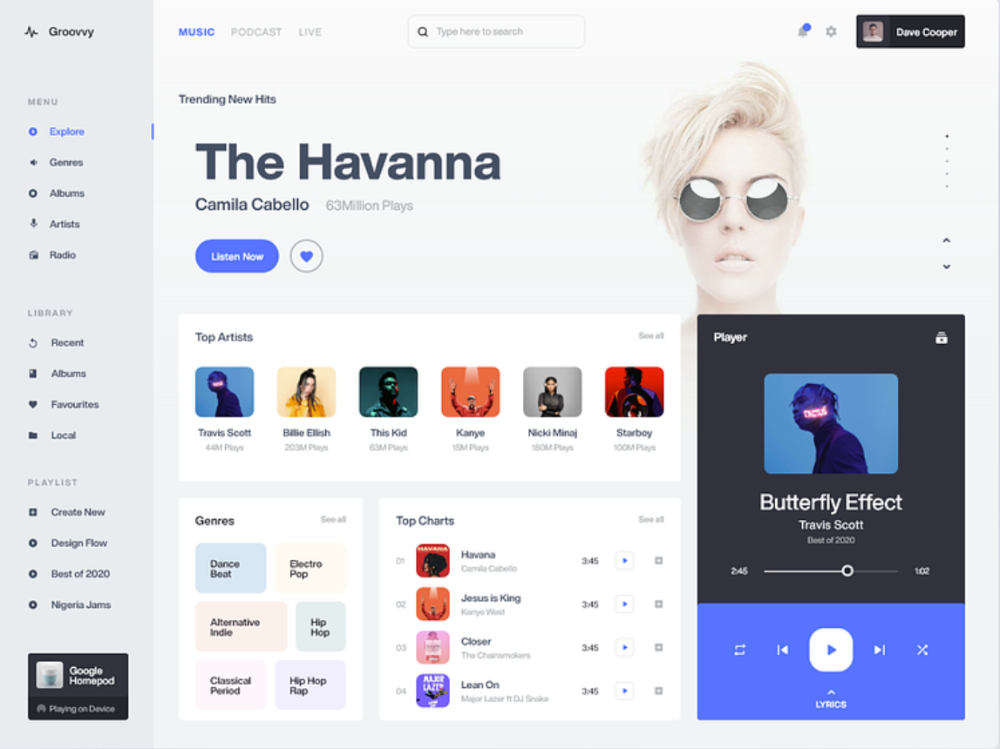

<h1> MUSIC PLAYER</h1>

 This is a simple music app i made using <b>html</b> and <b>css</b>.
  It has no functionality. I took inspiration from dribbble.com.
  It's only responsive for desktop screens.
  The purpose of this is simple project is to solidify my css skills.

<h3> IMAGE</h3>
<h5> Inspiration </h5>

<h5> Code</h5>

